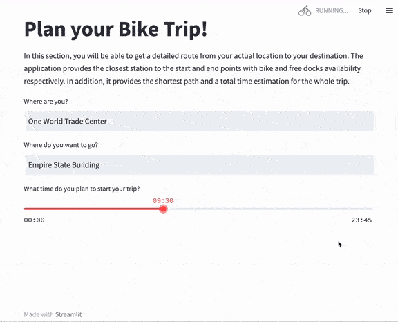

# 🚲 NYC Citi Bike Study
The purpose of this app is to make NYC Citi Bike Service data available and to anyone and understandable in a visual and intuitive way. The project is divided in two parts: an exploratory analysis on monthly trips, and a trip prediction tool designed for the end user to plan a trip ahead.

## 📊 Exploratory Analysis
Each Citi Bike trip contain a lot of information: start station, end station, time of the day, etc., and, combining all trips together, we can reach interesting conclusions on the overall behavior of users. In the System Overview tab, you will find plenty of insights regarding Stations, Demographics and Trip information, which will for sure help you get a broader picture of the system as a whole.

## 🗺️ Your Trip
The main concerns of Citi Bike system users are bike and free docks availability in the start and end points respectively. 'Your Trip' section has been designed to tackle uncertainty and provide availability predictions for users to plan their trips with time margin.

## 📁 Data Sources
For Data enthusiasts, there is another section including samples of the main dataframes used for the project. In addition, code is fully available in the GitHub repository of the project, containing all functions and processes to clean and enrich data, plot visualizations and power the prediction app.

## 🧩 Main Challenges of the Project
NYC Citi Bike webpage contains plenty of public datasets with monthly trip information. For the Exploratory Analysis, the data available is excellent, it can lead to many conclusions and and meaningful insights. However, when it comes to predict future behaviour, a huge challenge is faced. There is some missing data with a really important weight, e.g. the initial number of bikes in each station at time 0, the number of bike movements by trucks, etc. Many have been figured out, others assumed, but the overall quality of the enriched dataframe has made it possible to reach significant predictions! 